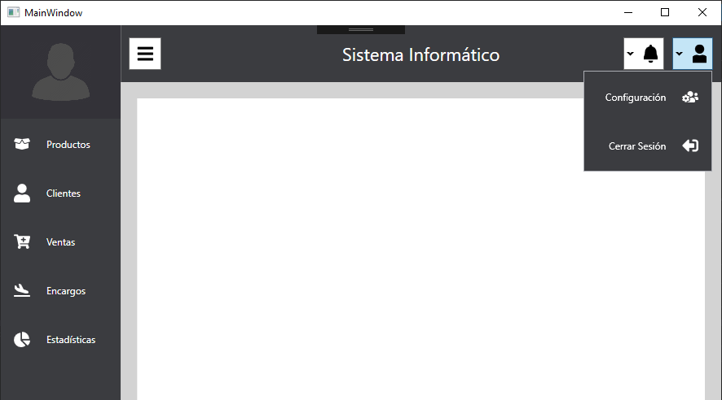

# Dashboard-Wpf
Simple dashboard template for C# WPF projects, you can use it in your projects for free, learning purposes, etc. The template implements the grid system and a custom animation clash for the sidebar.

# Tools used
-Wpf\
-Wpf Extended Tools for dropdown buttons\
-Font awesome nuget package for icons\
-Extra thanks to https://www.codeproject.com/Articles/18379/WPF-Tutorial-Part-Writing-a-custom-animation-cla for the custom animation class

# Screenshot 

